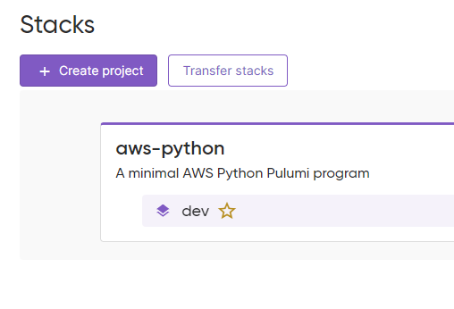
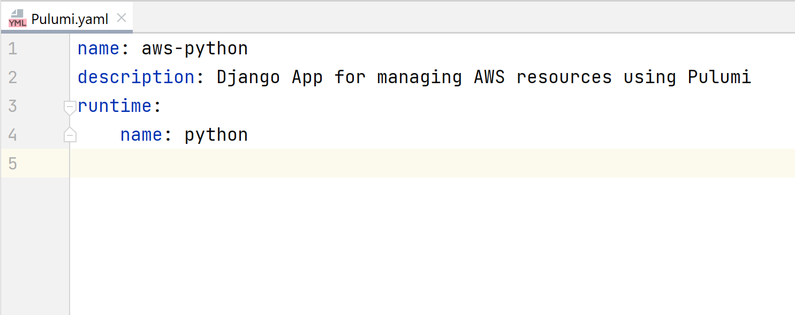
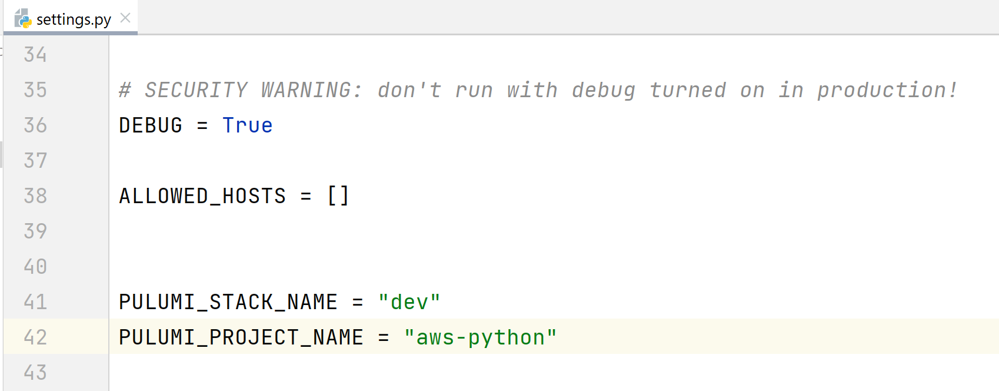
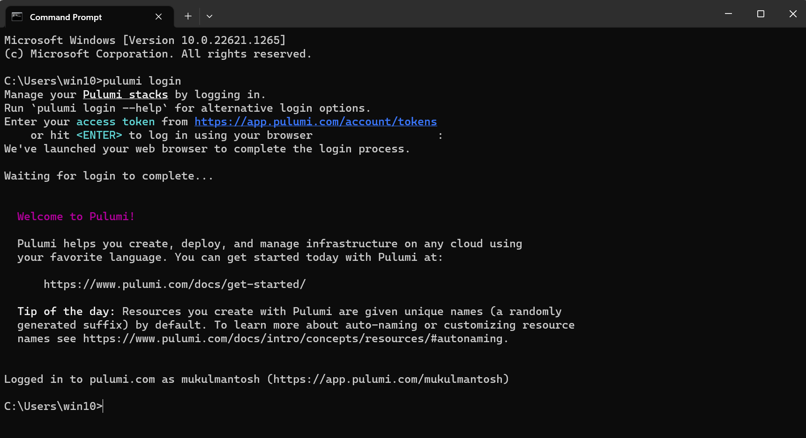
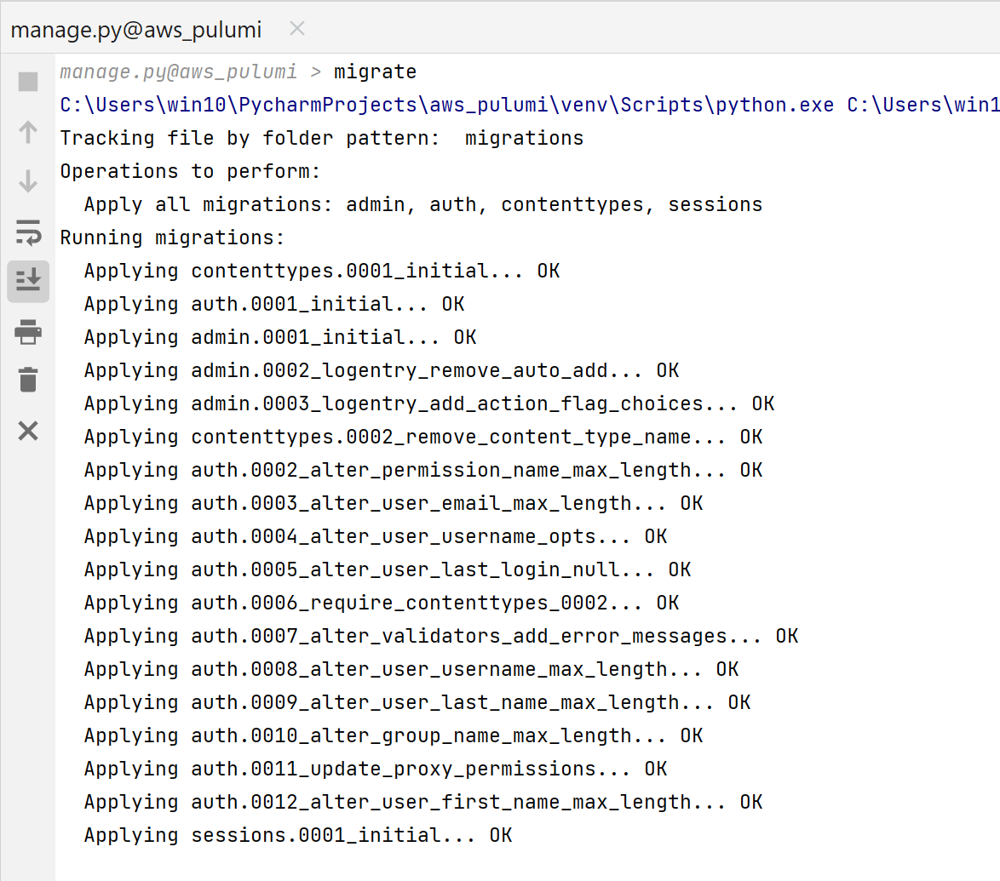
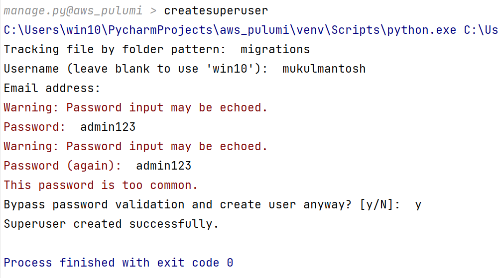

# IaaC using Django & Pulumi
<br>


## Prerequisites 

Before starting up this project, make sure you have an AWS account.

### Software Installation

- [x] [AWS Command Line Interface](https://aws.amazon.com/cli/) - The AWS Command Line Interface (CLI) is a unified tool to manage your AWS services.


- [x] [Pulumi](https://www.pulumi.com/) - Universal Infrastructure as Code


## Python Dependencies

- Installing Python Packages

```bash

$ pip install -r requirements.txt

```

## Pulumi Stack

Login to Pulumi and create a new project.

Make sure to name the stack as **aws-python**.





Update the respective YAML files & django settings in the codebase.

**Pulumi.yaml**



**settings.py**




## Pulumi CLI

Run the below command :
- **pulumi login**




## Migrating Tables

Run the below command :

- **python manage.py migrate**




## Creating SuperUser

Run the below command : 

- **python manage.py createsuperuser**




## AWS Credentials

Make sure to update your AWS credentials, residing in **$HOME/.aws/credentials**

* Note: For this demo, make sure the IAM User should have **AdministratorAccess**. This is not **recommended** permission you need to give. Kindly, follow the security best practices.

```
[default]
aws_access_key_id = xxxxxxxxxxxxxxxxxxxxx
aws_secret_access_key = xxxxxxxxxxxxxxxxxxxxxxx
```


## Loading AWS Resources


## References

If you are interested to know more about Pulumi.

- [How to use Pulumi YAML](https://www.pulumi.com/docs/intro/languages/yaml/)
- [Pulumi Automation API](https://www.pulumi.com/automation/) 